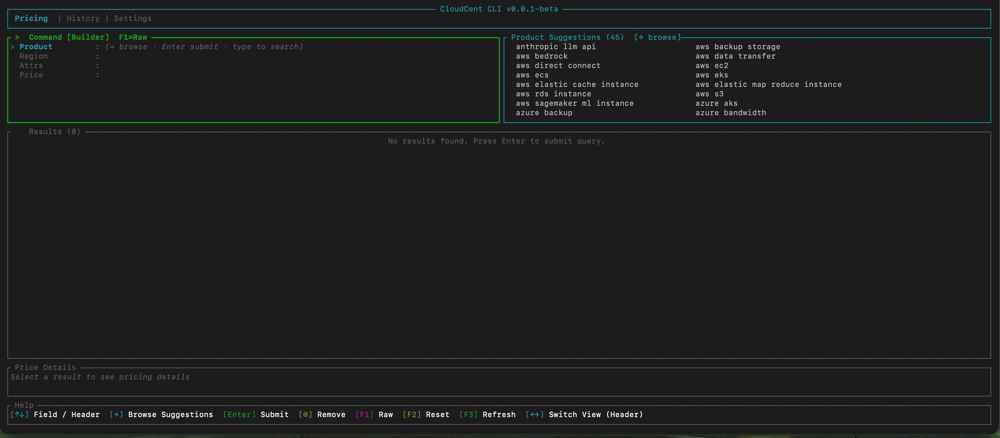
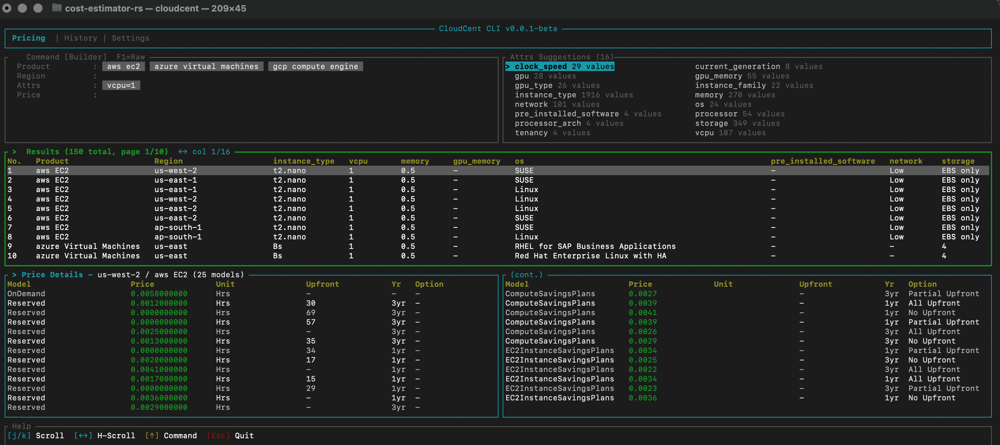

# CloudCent Cli

A terminal UI for querying and comparing cloud pricing across providers, built with Rust and [Ratatui](https://ratatui.rs).


> ⚠️ Beta: each query returns up to 150 results, sorted by min price ascending.

## Two Ways to Query

CloudCent works in both directions — start from what you know, find what you need:

- **Spec → Cost**: Know your requirements? Describe the instance type, region, storage class, or any spec, and CloudCent returns the matching price. Filter by vCPU count, memory, storage tier, and more.
- **Cost → Spec**: Have a budget? Set a price ceiling or floor and discover which products and configurations fit within it. Use `>`, `<`, `>=`, `<=` operators to explore what's available at your price point.

## Features

- Multi-cloud pricing search — query pricing data across AWS, GCP, Azure and more from a single interface
- Smart suggestions — fuzzy matching and semantic aliases (e.g. type "compute" to find EC2, Compute Engine, VMs)
- Command builder — structured form with product, region, attribute, and price filter fields with autocomplete
- Raw command mode — type queries directly for power users (`product <name> region <region> attrs <key=value>`)
- Attribute filtering — drill into instance types, storage classes, vCPU counts, etc.
- Price operators — filter results with `>`, `<`, `>=`, `<=`
- Query history — browse past queries, preview cached results, and re-run with one keystroke
- Local caching — SQLite-backed cache for pricing data and metadata (3-day TTL)
- Settings view — view your CLI ID, API key, and config path
- Cross-platform — runs on macOS, Linux, and Windows (x64 and ARM64)

## Installation

### npm (recommended)

```bash
npm install -g @cloudcent/cli
```

### Shell script (macOS / Linux)

```bash
curl -fsSL https://raw.githubusercontent.com/OverloadBlitz/cloudcent-cli/main/install.sh | bash
```

### PowerShell (Windows)

```powershell
irm https://raw.githubusercontent.com/OverloadBlitz/cloudcent-cli/main/install.ps1 | iex
```

### Build from source

```bash
git clone https://github.com/OverloadBlitz/cloudcent-cli.git
cd cloudcent-cli
cargo build --release
# Binary at target/release/cloudcent
```

## Quick Start

```bash
cloudcent
```

On first launch you'll be prompted to authenticate via browser. This sets up a free API key stored at `~/.cloudcent/config.yaml`.

**Home**



**Pricing example**



## Supported Providers & Pricing Models

| Provider | Services |
|----------|----------|
| AWS | EC2, ECS, EKS, S3, RDS, ElastiCache, EMR, SageMaker, Bedrock, Direct Connect, Data Transfer, Backup |
| GCP | Compute Engine, Cloud Storage, Cloud SQL, GKE, Memorystore, Vertex AI, Big Data, Data Transfer |
| Azure | Virtual Machines, AKS, Container, Storage, SQL Database, Redis, Backup, Machine Learning, OpenAI, ExpressRoute, Bandwidth, Big Data |
| OCI | Compute, Object Storage, Database Instance, Cache, Backup, FastConnect, Data Transfer, Generative AI |
Pricing models vary by provider — OnDemand, Reserved/Committed, Spot/Preemptible, and token-based (for AI APIs).mptible, and token-based (for AI APIs).

> Beta limitation: each query returns up to 150 results, sorted by min price ascending.

> Available products and pricing models are fetched dynamically from the API and may expand over time.

## Project Structure

```
src/
├── main.rs              # Entry point
├── config.rs            # YAML config (~/.cloudcent/config.yaml)
├── api/
│   ├── client.rs        # HTTP client (pricing, metadata, auth)
│   └── models.rs        # API request/response types
├── commands/
│   ├── pricing.rs       # Pricing options loading and metadata processing
│   └── user.rs          # Authentication flow (browser OAuth)
├── db/
│   └── mod.rs           # SQLite (history, pricing cache, metadata cache)
└── tui/
    ├── app.rs           # App state and event loop
    ├── ui.rs            # Top-level render dispatch
    ├── semantic.rs      # Fuzzy matching and alias engine
    └── views/
        ├── pricing.rs   # Pricing query builder and results table
        ├── settings.rs  # Config display
        └── history.rs   # Query history and cache stats
```

## Configuration

Config is stored at `~/.cloudcent/config.yaml` with permissions set to `600` on Unix.

Data files:
- `~/.cloudcent/metadata.json.gz` — compressed pricing metadata
- `~/.cloudcent/cloudcent.db` — SQLite database (history, cache)

## Contributing

Contributions are welcome. Here's how to get started:

1. Fork the repo and create a branch from `main`
2. Build the project locally:
   ```bash
   cargo build
   ```
3. Run in dev mode:
   ```bash
   cargo run
   ```
4. Make your changes — keep them focused and minimal
5. Ensure the code compiles cleanly:
   ```bash
   cargo check && cargo clippy
   ```
6. Open a pull request with a clear description of what you changed and why


## License

[Apache License 2.0](LICENSE)
If you're planning a larger change, open an issue first to discuss the approach.

### Reporting issues

Found a bug or have a feature request? [Open an issue](https://github.com/OverloadBlitz/cloudcent-cli/issues) and include:

- A clear description of the problem or request
- Steps to reproduce (for bugs)
- Your OS and architecture (e.g. macOS arm64, Linux x64)
- Any relevant error output or screenshots